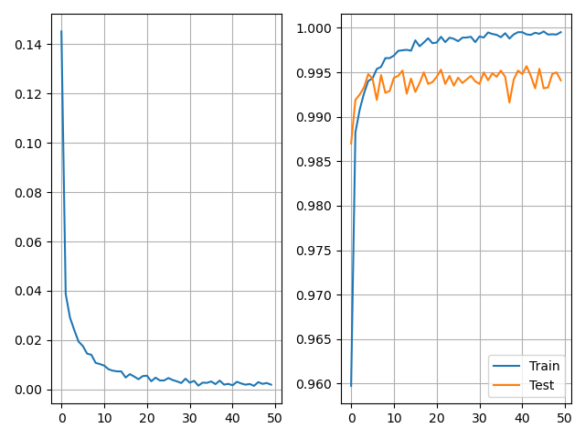
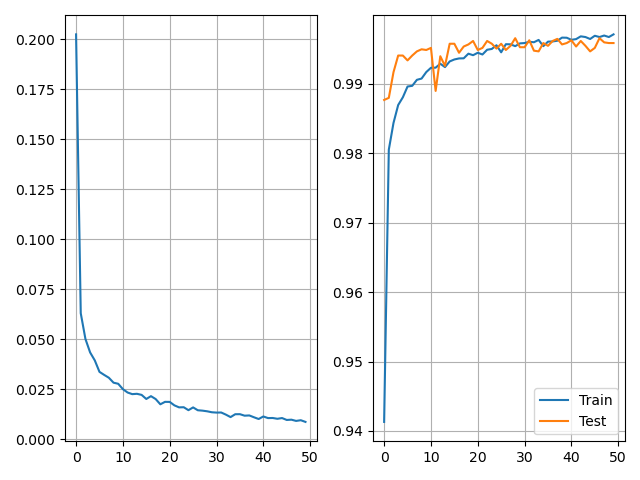
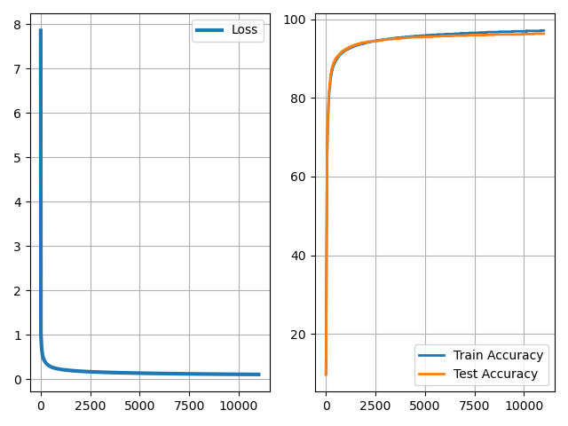

This application recognizes the numbers you draw.
The models were trained on the MNIST dataset.
No additional preprocessing techniques were applied.

|              Model              | Max accuracy, % |
|:-------------------------------:|:---------------:|
| My perceptron with 2[^1] layers |      85.3       |
| My perceptron with 3[^1] layers |      96.3       |
|        KNN (3 neighbors)        |      97.3       |
|               SVM               |      97.9       |
|    Bagging (100 estimators)     |      96.9       |
|    XGBoost (500 estimators)     |      98.1       |
|          Random Forest          |      94.3       |
|          Custom DNN 1           |      99.4       |
|          Custom DNN 2           |      99.6       |

[^1]: an input layer was taken into account

# Custom DNN architecture

```python
import torch.nn as nn

custom_model = nn.Sequential(
    nn.Conv2d(1, 32, 3, padding=1), nn.BatchNorm2d(32), nn.ReLU(),
    nn.Conv2d(32, 32, 3, padding=1), nn.BatchNorm2d(32), nn.ReLU(),
    nn.MaxPool2d(2),

    nn.Conv2d(32, 64, 3, padding=1), nn.BatchNorm2d(64), nn.ReLU(),
    nn.Conv2d(64, 64, 3, padding=1), nn.BatchNorm2d(64), nn.ReLU(),
    nn.MaxPool2d(2),

    nn.Conv2d(64, 96, 3, padding=1), nn.BatchNorm2d(96), nn.ReLU(),
    nn.MaxPool2d(2),

    nn.Flatten(),
    nn.Dropout(0.1),
    nn.Linear(96 * 3 * 3, 256), nn.ReLU(),
    nn.Dropout(0.1),
    nn.Linear(256, 128), nn.ReLU(),
    nn.Dropout(0.1),
    nn.Linear(128, 10)
)
```

DNN 1 has no applied transformations. DNN 2 has the following ones:

```python
from torchvision.transforms import transforms

train_transform = transforms.Compose([
    transforms.RandomRotation(10),
    transforms.RandomAffine(0, translate=(0.08, 0.08)),
    transforms.ToTensor(),
    transforms.Normalize((0.1307,), (0.3081,))
])

test_transform = transforms.Compose([
    transforms.ToTensor(),
    transforms.Normalize((0.1307,), (0.3081,))
])
```

During training, the images are randomly rotated by up to 10 degrees and shifted horizontally or vertically by as much as 8% of their width or height.
Both the training and test images are normalized, using the mean and standard deviation computed across all 60,000 training samples (see analyze_dataset.ipynb for details).
These augmentation and normalization steps help reduce overfitting by effectively increasing the variety of training examples.

The graphs below show the training results for DNN versions 1 and 2.




Data transformations help prevent the model from overfitting.
Interestingly, the perceptron shows a nearly monotonic decrease in loss with no signs of overfitting.
This is likely due to its relatively small number of parameters.


